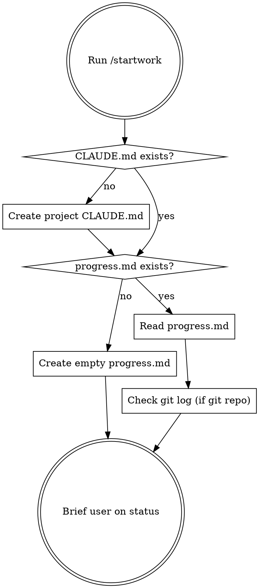

# Start Work Session

## What This Does

Initialize a project for session-based work tracking, or resume from where the last session left off.

## Workflow



## Step-by-step

### 1. Project CLAUDE.md

If the project root has no `CLAUDE.md`, create one with this minimal template:

```markdown
# Project Name

## Overview
(brief project description)

## Session Continuity
- At session start, always check `progress.md` for current work status.
- Before ending a session, run `/stopwork` to save progress.
```

If `CLAUDE.md` already exists, leave it as-is.

### 2. progress.md

If `progress.md` does not exist, create it:

```markdown
# Work Progress

## Current Task
- (none yet)

## Last Session
- (first session)

## Next Steps
- (to be determined)

## Key Decisions
- (none yet)
```

If it exists, read it in full.

### 3. Git History (if applicable)

If the project is a git repo, check recent commits since the last session date noted in progress.md:

```bash
git log --oneline -10
```

### 4. Brief the User

Provide a concise summary:
- What was done in the last session
- What the next steps are
- Any recent git changes not captured in progress.md
- Ask the user what they want to work on today
