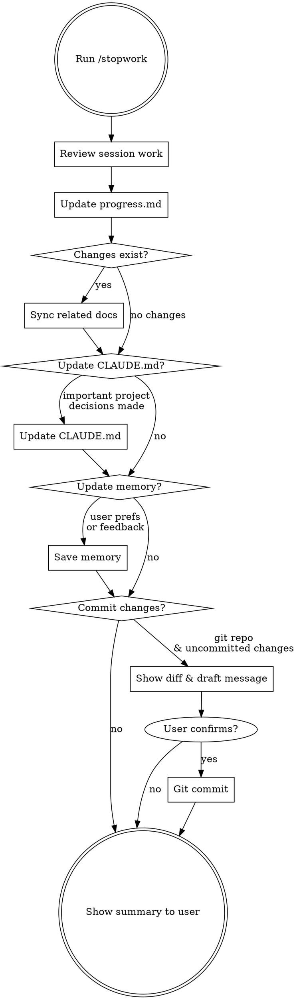

# Stop Work Session

## What This Does

Capture everything from the current session into `progress.md` so the next session can pick up seamlessly.

## Workflow



## Step-by-step

### 1. Review Session Work

Gather what happened this session:
- Check `git diff` and `git log` for changes made during this session (if git repo)
- Review the conversation context for tasks completed, decisions made, and blockers encountered

### 2. Update progress.md

Overwrite `progress.md` with the current state. Use this structure:

```markdown
# Work Progress

## Current Task
- (what is actively being worked on, or "completed" if finished)

## Last Session (YYYY-MM-DD)
- (bullet list of what was done THIS session)
- Be specific: files changed, features added, bugs fixed

## Next Steps
- [ ] (concrete next action items)
- [ ] (prioritized in order)

## Key Decisions
- (any architectural or design decisions made and WHY)

## Blockers / Notes
- (anything the next session should be aware of)
```

### 3. Sync Related Documents (if changes exist)

Skip this step if no code or configuration changes were made this session.

When changes exist, synchronize all development-related documents with the current state:

1. **Identify changed files** — use `git diff` and `git log` (or conversation context if not a git repo)
2. **Find related documents** — scan the project for:
   - `PRD.md` — update requirement status (completed, in-progress, pending), add new requirements discovered during implementation
   - `README.md` — update setup instructions, usage examples, feature lists if they changed
   - `docs/` directory — update API docs, architecture docs, guides affected by changes
   - `CHANGELOG.md` — add entries for notable changes if the project uses one
   - Any other project-specific documentation referenced in PRD.md or CLAUDE.md
3. **Update each document** to reflect the current state:
   - Mark completed features/requirements as done
   - Update examples or instructions that no longer match the code
   - Add documentation for newly introduced features or APIs
   - Remove references to deleted functionality
4. **Show the user** which documents were updated and what changed, for confirmation

**Important:**
- Only update documents that actually need changes — do not touch docs unrelated to this session's work
- Preserve the existing style and format of each document
- If unsure whether a document needs updating, ask the user

### 4. Update CLAUDE.md (if needed)

Only update the project's `CLAUDE.md` if this session produced important, long-lived project knowledge:
- New coding conventions or rules
- Architecture decisions
- Build/test commands
- Important warnings

Do NOT add session-specific or temporary information to CLAUDE.md.

### 5. Update Memory (if needed)

Save to memory only if:
- User gave feedback on how they want to work (feedback type)
- Learned something new about the user's role or preferences (user type)
- Discovered external references worth remembering (reference type)

### 6. Commit Changes (if git repo)

Skip this step if the project is not a git repository or there are no uncommitted changes.

1. **Show staged/unstaged changes** — run `git status` and `git diff --stat` to show the user what will be committed
2. **Draft a commit message** — summarize the session's work in a concise commit message
3. **Ask the user for confirmation** — present the commit message and file list, and wait for approval before committing
4. **Commit** — only after the user confirms, stage the relevant files and create the commit
5. Do NOT push to remote unless the user explicitly asks

### 7. Show Summary

Display a brief confirmation to the user:

```
Session saved. Summary:
- Done: (1-2 line summary)
- Next: (top priority next step)
- Committed: (commit hash & message, or "skipped")
- Files updated: progress.md [, CLAUDE.md] [, memory]
```
