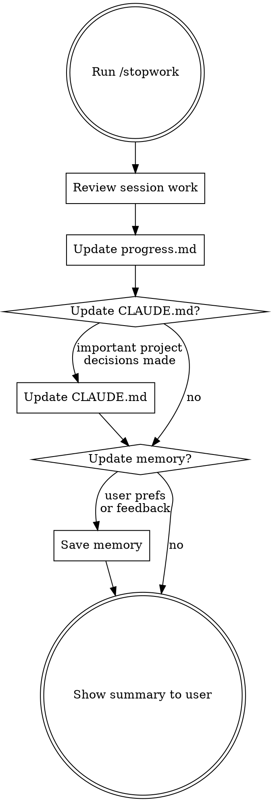

# Stop Work Session

## What This Does

Capture everything from the current session into `progress.md` so the next session can pick up seamlessly.

## Workflow



## Step-by-step

### 1. Review Session Work

Gather what happened this session:
- Check `git diff` and `git log` for changes made during this session (if git repo)
- Review the conversation context for tasks completed, decisions made, and blockers encountered

### 2. Update progress.md

Overwrite `progress.md` with the current state. Use this structure:

```markdown
# Work Progress

## Current Task
- (what is actively being worked on, or "completed" if finished)

## Last Session (YYYY-MM-DD)
- (bullet list of what was done THIS session)
- Be specific: files changed, features added, bugs fixed

## Next Steps
- [ ] (concrete next action items)
- [ ] (prioritized in order)

## Key Decisions
- (any architectural or design decisions made and WHY)

## Blockers / Notes
- (anything the next session should be aware of)
```

### 3. Update CLAUDE.md (if needed)

Only update the project's `CLAUDE.md` if this session produced important, long-lived project knowledge:
- New coding conventions or rules
- Architecture decisions
- Build/test commands
- Important warnings

Do NOT add session-specific or temporary information to CLAUDE.md.

### 4. Update Memory (if needed)

Save to memory only if:
- User gave feedback on how they want to work (feedback type)
- Learned something new about the user's role or preferences (user type)
- Discovered external references worth remembering (reference type)

### 5. Show Summary

Display a brief confirmation to the user:

```
Session saved. Summary:
- Done: (1-2 line summary)
- Next: (top priority next step)
- Files updated: progress.md [, CLAUDE.md] [, memory]
```
